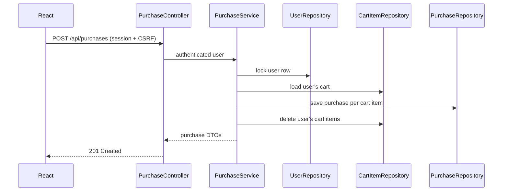

# 通販システム MVP 設計書

## 1. 前提と翻訳方針

要求文に示されたユースケース、画面遷移、データ項目、業務ルールを根拠に、JSP/Action/DAO/Bean の構造を Spring Boot REST API + React の構造へ翻訳する。指定された添付フォルダには設計画像ファイルが存在しなかったため、画像からしか確定できない事項は本実装では追加しない。

### 仕様の分類

- **元設計・要求文から確認できる仕様**: ログイン、ログアウト確認、商品一覧・詳細、ジャンル絞り込み、カート追加・表示、購入確認・確定・完了、購入履歴。商品単位の購入記録、ユーザーごとのカート・履歴分離、在庫0時のカート追加禁止。
- **技術的な置き換え**: JSPはReact画面、Action/ServletはREST Controller、Serviceは業務処理、DAOはSpring Data JPA Repository、BeanはEntity/DTOへ置き換える。画面遷移はブラウザ履歴を使うReact側のルーティングで行う。
- **最小限の補完**: DBは再起動後も残るH2ファイルDB、認証はSpring SecurityのHTTPセッション、パスワードはBCryptハッシュ、ジャンルはProduct.genre文字列、購入価格は確定時の商品単価、同一商品の再追加は別CartItem行、開発用データは初回のみ投入。
- **未確定・今回未実装**: 購入時の在庫減算・予約・数量上限、カート数量変更・個別削除、注文ヘッダー・注文番号・決済・配送、会員登録、商品管理、検索拡張、レビュー、お気に入り。

## 2. 画面と遷移

| React route | 内容 | 認証 |
| --- | --- | --- |
| `/` | 商品一覧、ジャンル絞り込み、未ログイン時のログインボタン、ログイン時のカート・履歴・ログアウト | 不要 |
| `/login` | メールアドレス・パスワード入力 | 不要 |
| `/products/:productId` | 商品詳細、数量選択、カート追加 | 閲覧不要、追加は必要 |
| `/cart` | 自分のカート、合計、購入する | 必須 |
| `/purchase/confirm` | カート全体の購入確認 | 必須 |
| `/purchase/complete` | 購入完了表示のみ。再購入APIは呼ばない | 必須 |
| `/history` | 自分の購入履歴 | 必須 |

購入遷移は `/cart` → `/purchase/confirm` → POST `/api/purchases` → `/purchase/complete` とする。購入確認の表示・キャンセルではDBを変更しない。

## 3. REST API

すべてのエラーは `{ "message": "..." }` のJSONで返す。ログインが必要なAPIではリクエストのuserIdを使用せず、Spring Securityの認証済みPrincipalから利用者を特定する。

| Method / path | Request | Response | 認証 | 主なエラー |
| --- | --- | --- | --- | --- |
| GET `/api/auth/csrf` | なし | `{token}` | 不要 | - |
| GET `/api/auth/me` | なし | `{authenticated, user}` | 不要 | - |
| POST `/api/auth/login` | `{email,password}` | `{user}` | 不要 | 401 |
| POST `/api/auth/logout` | なし | 204 | セッションがあれば処理 | 403(CSRF) |
| GET `/api/products?genre=...` | 任意のgenre | 商品DTO配列 | 不要 | 400 |
| GET `/api/products/{productId}` | path ID | 商品DTO | 不要 | 404 |
| GET `/api/cart` | なし | `{items,totalAmount}` | 必須 | 401 |
| POST `/api/cart/items` | `{productId,quantity}` | 201、追加行DTO | 必須 | 400/404/409 |
| POST `/api/purchases` | なし | `{purchases}` | 必須 | 401/409 |
| GET `/api/purchases` | なし | 購入履歴DTO配列 | 必須 | 401 |

CSRFはCookieCsrfTokenRepositoryで発行し、Reactは `X-XSRF-TOKEN` ヘッダーを付けて状態変更APIを呼ぶ。認証・ログアウト・カート追加・購入はGETで実行しない。

## 4. Entityと参照関係

- `AppUser`: `userId`, `email`, `passwordHash`, `name`。DBテーブル名は予約語回避のため `app_users`。
- `Product`: `productId`, `name`, `price`(long), `genre`, `stock`(int), `image`, `description`。
- `CartItem`: `cartId`, `user`(ManyToOne)、`product`(ManyToOne)、`quantity`。Entityを直接JSON公開せず、DTOに変換する。同一商品の再追加は別行として保存する。
- `Purchase`: `purchaseId`, `user`(ManyToOne)、`product`(ManyToOne)、`quantity`, `price`(long), `purchasedAt`(サーバー時刻)。購入時点の価格を保持する。

金額は浮動小数点を使用せずlongで計算し、`Math.addExact`/`Math.multiplyExact`でオーバーフローを検出する。

## 5. 認証と購入トランザクション

認証はSpring SecurityのDaoAuthenticationProvider + BCrypt + HTTPセッションを使う。メールアドレスでユーザーを取得し、保存済みハッシュを照合する。パスワード、ハッシュ、セッション情報はレスポンスやログに出さない。

購入確定は `PurchaseService.purchaseCart` の単一 `@Transactional` 境界で実行する。利用者行を悲観ロックして同一利用者の購入を直列化し、カート全行を取得、商品単価をサーバー側から読み、商品ごとのPurchaseを保存した後、対象利用者のCartItemだけを削除する。空カートは409とし、途中例外では保存・削除をロールバックする。

## 6. 実装・テスト対応

| ユースケース | 主な実装 | 検証 |
| --- | --- | --- |
| 認証/ログアウト | `AuthController`, `SecurityConfig`, `AuthService` | `AuthControllerTest`、手動API確認 |
| 商品/ジャンル/詳細 | `ProductController`, `ProductService` | `ProductControllerTest`、フロントビルド |
| カート | `CartController`, `CartService` | `CartServiceTest`、手動API確認 |
| 購入/履歴 | `PurchaseController`, `PurchaseService` | `PurchaseServiceTest`、手動API確認 |
| 画面遷移・再読み込み | `frontend/src/App.tsx` | `npm run build`、開発サーバーで主要画面確認 |

